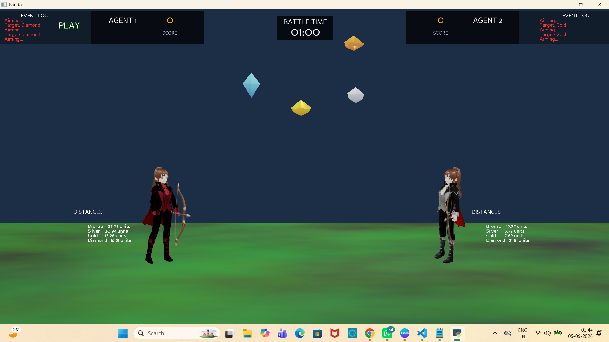
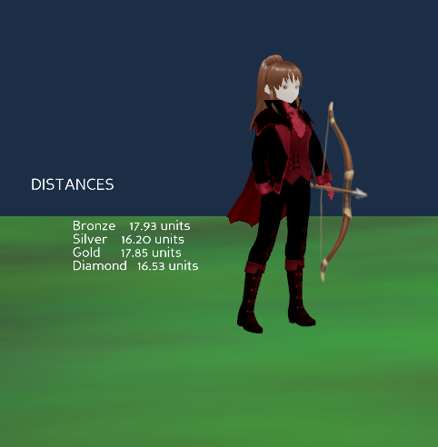
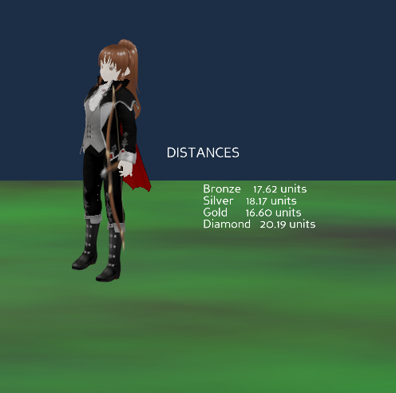

# 🏹 AI Archer Arena

### Real-Time Autonomous Agent vs Agent — Python + Panda3D

> **An autonomous 3D archery arena where two AI-driven agents independently observe the environment, evaluate moving targets, estimate hit probability, balance reward against risk, adapt their strategy to the scoreboard, and compete in real time.**

[](https://www.python.org/)
[](https://www.panda3d.org/)
[](https://git-scm.com/)
[](https://github.com/)
[](https://git-lfs.github.com/)

---

## 🎥 Gameplay Demo

### Real-Time Autonomous Agent vs Agent

The following video demonstrates the autonomous agents competing inside the 3D archery arena.

<p align="center">
  <a href="media/AI_Archer_Arena_Demo.mp4">
    
  </a>
</p>

<p align="center">
  <b>▶ Click the image above to open the gameplay demonstration.</b>
</p>

The demonstration showcases:

- Two autonomous agents competing in real time
- Independent target selection
- Moving targets
- Target movement analysis
- Future-position prediction
- Hit-probability estimation
- Expected reward calculation
- Utility-based decision making
- Risk-aware target selection
- Opponent-aware decision making
- Adaptive strategic behavior
- Projectile firing
- Hit/miss evaluation
- Dynamic scoring
- Live event logging

> **Video:** `media/AI_Archer_Arena_Demo.mp4`

The gameplay video is tracked using **Git LFS** because of its large binary file size.

---

## 📌 Project Overview

**AI Archer Arena** is a real-time autonomous Agent vs Agent 3D archery environment developed using **Python and Panda3D**.

Instead of directly controlling the archers, the project places the decision-making responsibility inside autonomous agents.

Each agent continuously observes the game environment, evaluates available targets, estimates the likelihood of success, considers reward and risk, and selects an action according to its current strategy.

The agents are intentionally configured with different decision-making personalities.

This creates a competitive environment where:

```
Same Environment
       ↓
Different Agent Personalities
       ↓
Different Decision Priorities
       ↓
Different Target Choices
       ↓
Real-Time Competition
```

The project focuses on interpretable autonomous decision making using engineered heuristics, utility scoring, probability estimation, target experience, and strategic adaptation.

---

## 🎯 Core Idea

The central autonomous decision loop is:

```
Observe
   ↓
Analyze Environment
   ↓
Evaluate Available Targets
   ↓
Estimate Target Movement
   ↓
Predict Future Position
   ↓
Estimate Hit Probability
   ↓
Calculate Expected Reward
   ↓
Evaluate Risk
   ↓
Consider Opponent Pressure
   ↓
Apply Repeat Penalty
   ↓
Apply Current Strategy
   ↓
Calculate Utility
   ↓
Select Target
   ↓
Aim
   ↓
Fire
   ↓
Projectile Flight
   ↓
Evaluate Hit / Miss
   ↓
Update Score & Experience
   ↓
Make Next Decision
```

This creates a continuous decision loop rather than a fixed scripted gameplay sequence.

---

## 🤖 Autonomous Agent System

The most important component of AI Archer Arena is the autonomous agent decision engine.

Each agent independently evaluates the game environment and determines which target to attack.

The decision engine considers:

- Target value
- Target distance
- Target movement
- Movement difficulty
- Estimated hit probability
- Expected reward
- Risk cost
- Opponent score
- Current strategic state
- Recent target history
- Repeat-target penalty
- Agent-specific personality
- Shooting efficiency
- Predicted target position

The two agents are intentionally configured with different decision priorities.

This allows the same environment to produce different autonomous behaviors.

### 🧠 Agent 1 — Risk Hunter

<p align="center">  </p>

**RISK_HUNTER**

Agent 1 is configured as a more aggressive decision maker.

Its decision policy gives greater importance to reward potential and accepts a higher level of risk when evaluating difficult targets.

**Main Characteristics**
- Higher risk tolerance
- Stronger preference for valuable targets
- Greater willingness to attempt difficult shots
- Reward-oriented decision making
- Calculated risk taking
- Lower emphasis on shooting speed

**Configuration**

| Parameter | Value |
|---|---|
| Personality | RISK_HUNTER |
| Risk Tolerance | 0.78 |
| Value Weight | 1.25 |
| Speed Weight | 0.12 |
| Distance Penalty | 0.035 |
| Opponent Pressure | 0.20 |

The higher risk tolerance allows Agent 1 to accept challenging opportunities when the expected reward justifies the risk.

### 🧠 Agent 2 — Tactical Optimizer

<p align="center">  </p>

**TACTICAL_OPTIMIZER**

Agent 2 is configured as a more conservative and efficiency-oriented decision maker.

Its policy places greater emphasis on tactical efficiency, accessibility, speed, opponent pressure, and avoiding unnecessary risk.

**Main Characteristics**
- Lower risk tolerance
- Greater emphasis on efficiency
- Stronger speed consideration
- Higher opponent-pressure sensitivity
- More selective target choices
- Greater penalty for difficult or distant opportunities

**Configuration**

| Parameter | Value |
|---|---|
| Personality | TACTICAL_OPTIMIZER |
| Risk Tolerance | 0.38 |
| Value Weight | 1.00 |
| Speed Weight | 0.30 |
| Distance Penalty | 0.055 |
| Opponent Pressure | 0.35 |

The lower risk tolerance makes Agent 2 more selective when evaluating difficult targets.

---

## ⚔️ Why Two Different Agents?

A major design goal of the project is to demonstrate how different decision policies can produce different autonomous behavior while operating inside the same environment.

Both agents observe the same arena, targets, and scoreboard. However, their priorities are different.

```
                 SAME ARENA
                     │
          ┌──────────┴──────────┐
          ↓                     ↓
      AGENT 1               AGENT 2
   RISK_HUNTER          TACTICAL_OPTIMIZER
          │                     │
          ↓                     ↓
  Higher reward focus      Higher efficiency
  Higher risk tolerance   Lower risk tolerance
          │                     │
          └──────────┬──────────┘
                     ↓
              AGENT vs AGENT
```

This produces more meaningful competition than simply running identical AI controllers.

---

## 💎 Target & Reward System

The arena contains four target classes.

| Target | Reward |
|---|---|
| 🟠 Bronze | 10 points |
| ⚪ Silver | 20 points |
| 🟡 Gold | 30 points |
| 💎 Diamond | 50 points |

The important principle is:

> The highest-value target is not automatically the best target.

A Diamond target may offer 50 points, but if it is far away or difficult to hit, its expected utility may be lower than a more accessible target.

Therefore, the agents evaluate targets rather than simply selecting the target with the highest raw value.

---

## 📐 Distance-Aware Decision Making

Distance is an important factor in target evaluation.

The agent considers the spatial relationship between itself and each candidate target.

Distance can influence:

- Projectile travel time
- Hit probability
- Target utility
- Risk
- Shooting efficiency
- Predicted future distance

This allows the decision engine to distinguish between nearby and distant opportunities.

---

## 🎯 Hit Probability Estimation

The decision engine estimates the probability that a selected target can be successfully hit.

The estimate incorporates factors such as:

**Distance** — Greater distance can reduce the baseline probability of a successful hit.

**Movement Difficulty** — Moving targets can be more difficult to hit than stationary or slower targets.

**Target Experience** — Previous attempts and outcomes can influence the agent's evaluation of a target.

Conceptually:

```
Hit Probability
       =
Distance Effect
       +
Movement Analysis
       +
Agent Experience
```

The resulting estimate contributes to the expected-reward calculation.

---

## 🏃 Dynamic Moving Targets

Targets are not completely static.

The target system maintains information such as:

- Current position
- Destination
- Movement direction
- Movement speed
- Updated position

The targets continuously move within the arena.

This introduces uncertainty into the decision problem because a target can change position between target selection and projectile arrival.

---

## 🔮 Target Position Prediction

The agent does not rely only on the target's current position. It estimates where the target may be in the future.

Conceptually:

```
Current Target Position
          +
Target Velocity
          +
Estimated Projectile Travel Time
          ↓
Predicted Future Position
```

This allows the agent to reason about the target's future state during projectile flight.

---

## 🏹 Projectile System

The projectile system manages the arrows fired by the autonomous agents.

Responsibilities include:

- Projectile creation
- Arrow launching
- Projectile movement
- Position updates
- Target interaction
- Hit/miss evaluation
- Result communication
- Projectile lifecycle management

The projectile system is separated from the agent decision engine to maintain modularity.

---

## 🧮 Utility-Based Decision Engine

The core target-selection system uses utility-based evaluation.

Each available target receives a utility score based on multiple factors.

Conceptually:

```
Target Utility
      =
Expected Reward
+ Strategic Value
+ Opponent Pressure
- Movement Difficulty
- Risk Cost
- Repeat Penalty
- Distance / Time Costs
```

The exact influence of these factors depends on the agent's personality and current strategic state.

Therefore, an agent is not simply asking:

> "Which target has the most points?"

It is effectively asking:

> "Which target provides the strongest overall decision given my current strategy, risk tolerance, expected reward, opponent state, and target difficulty?"

---

## 💰 Expected Reward

Expected reward connects the target's value with its estimated probability of success.

Conceptually:

```
Expected Reward
=
Target Value × Estimated Hit Probability
```

For example:

```
Diamond
50 points
×
Estimated Hit Probability
=
Expected Reward
```

This prevents the agent from treating every target as equally achievable.

A 50-point target with a very low success probability may have lower utility than a 30-point target with a much higher probability of success.

---

## ⚠️ Risk-Aware Decision Making

The system explicitly considers risk.

Risk can be influenced by:

- Target difficulty
- Target movement
- Distance
- Potential reward
- Agent risk tolerance
- Current strategy

A high-risk agent can accept difficult opportunities. A conservative agent can prefer more reliable opportunities.

This creates different behavior from the same environment.

---

## 🧠 Adaptive Strategic States

The decision engine dynamically determines a strategic state based on the current scoreboard.

Implemented strategies include:

**COMEBACK** — Used when an agent is significantly behind. The agent can become more willing to prioritize high-value opportunities.

**PRESSURE** — Used when an agent is behind but the score difference is smaller. The decision process increases the importance of competitive pressure and target value.

**BALANCED** — Used when the competition is relatively close. The agent follows its normal decision policy without a strong strategic bias.

**LEAD_CONTROL** — Used when an agent has a significant lead. The decision process can become more conservative and avoid unnecessary risk.

---

## 📊 Strategy Selection

The strategic state is determined from the score difference.

Conceptually:

```
Score Difference ≤ -30
        ↓
     COMEBACK

Score Difference < 0
        ↓
     PRESSURE

Score Difference ≥ 30
        ↓
   LEAD_CONTROL

Otherwise
        ↓
    BALANCED
```

This gives the agents game-state awareness. Their behavior can therefore change during a match instead of remaining completely static.

---

## 🧠 Opponent Pressure

The current score of the opponent influences target evaluation.

When an agent is behind:

```
Behind
  ↓
Higher-value opportunities
become more attractive
```

When an agent is leading:

```
Ahead
  ↓
Unnecessary risk can become
less desirable
```

This introduces competitive context into the decision engine.

---

## 🔁 Repeat Target Penalty

The decision engine tracks recent target selections.

Repeatedly selecting the same target can result in a repeat penalty.

This helps prevent the agent from becoming excessively locked onto a single target.

Conceptually:

```
Recent Target History
        ↓
Count Repeated Selections
        ↓
Apply Repeat Penalty
        ↓
Reduce Target Utility
        ↓
Encourage Alternative Targets
```

---

## 📚 Target Experience

The agent maintains information related to previous target attempts and outcomes.

This allows past interaction history to contribute to future target evaluation.

Conceptually:

```
Previous Attempts
       ↓
Target Experience
       ↓
Future Evaluation
       ↓
Updated Decision
```

This is an experience-based heuristic mechanism rather than a trained machine-learning model.

---

## ⏱️ Time-Aware Decision Making

The decision engine also considers the time involved in executing an action.

Relevant factors include:

- Distance
- Projectile travel
- Aiming duration
- Shooting cycle
- Target accessibility
- Action efficiency

This introduces a time and efficiency dimension into target selection.

---

## 🧭 Agent Decision Flow

The autonomous agent follows a continuous decision process:

```
OBSERVE
   ↓
ANALYZE
   ↓
SELECT TARGET
   ↓
PREDICT TARGET POSITION
   ↓
AIM
   ↓
FIRE
   ↓
PROJECTILE FLIGHT
   ↓
HIT / MISS
   ↓
UPDATE SCORE
   ↓
UPDATE EXPERIENCE
   ↓
RE-EVALUATE
```

This loop continues throughout the competition.

---

## 🖥️ Real-Time Game Interface

The arena provides a real-time visual interface for observing the autonomous competition.

The game includes:

- 3D arena
- Two autonomous warriors
- Moving targets
- Projectiles
- Target reward values
- Live scoreboard
- Event logs
- Distance information
- Game timer
- PLAY control
- Dynamic lighting
- Night-sky environment
- Custom target visuals

---

## 📊 Live Scoreboard

The scoreboard displays the current performance of both agents.

It provides immediate visibility into the competition.

The score is also used by the decision engine to determine strategic states.

Therefore, the scoreboard serves both:

```
Visual Feedback
      +
Strategic Game State
```

---

## 📝 Event Log

The arena contains real-time event logging.

The event system can display important gameplay activity such as:

- Agent decisions
- Target selections
- Shots
- Hit/miss outcomes
- Score changes
- Gameplay events

This makes the autonomous behavior easier to observe and debug.

---

## 📏 Distance Display

The project includes real-time distance information between agents and targets.

Distance is useful both visually and computationally.

The relationship is:

```
3D World
   ↓
Spatial Information
   ↓
Distance Calculation
   ↓
AI Decision Engine
```

---

## 🎮 Game Controller

The game controller manages gameplay-level interaction.

The project includes a PLAY control that begins the active competition.

This allows the arena to initialize before the autonomous agents begin firing.

---

## 🌌 3D Environment

The arena is built using Panda3D.

The visual environment includes:

- 3D warrior models
- Bow-equipped warrior assets
- Gem-like targets
- Custom target materials
- Dynamic lighting
- Ambient lighting
- Directional lighting
- Night-sky background
- Custom target gradients
- Faceted target appearance

---

## 💎 Target Visual Design

The four target classes are visually differentiated according to their reward values.

```
Bronze   → 10 points
Silver   → 20 points
Gold     → 30 points
Diamond  → 50 points
```

The target implementation includes custom geometry, materials, lighting, and gradient/faceted visual effects.

---

## 🧱 Software Architecture

The project is divided into multiple Python modules.

This avoids putting all game logic inside a single file and improves maintainability.

```
AI Archer Arena
│
├── agent.py
│   └── Autonomous agent intelligence and decision engine
│
├── main.py
│   └── Main Panda3D application and game initialization
│
├── projectile.py
│   └── Arrow/projectile behavior and collision handling
│
├── target.py
│   └── Target creation, movement, visuals and reward values
│
├── scoreboard.py
│   └── Live score management and display
│
├── event_log.py
│   └── Real-time gameplay event logging
│
├── game_controller.py
│   └── Gameplay control and PLAY interaction
│
├── game_timer.py
│   └── Match timing
│
├── distance_display.py
│   └── Distance visualization
│
├── assets/
│   └── warriors/
│
└── media/
    ├── AI_Archer_Arena_Demo.mp4
    ├── autonomous-agent-arena.png
    ├── agent-1.png
    └── agent-2.png
```

---

## 📁 Project Structure

```
AI-Archer-Arena/
│
├── agent.py
│   └── Autonomous agent intelligence and decision engine
│
├── main.py
│   └── Main Panda3D application and game initialization
│
├── projectile.py
│   └── Arrow/projectile behavior and collision handling
│
├── target.py
│   └── Target creation, movement, visuals and reward values
│
├── scoreboard.py
│   └── Live score management and display
│
├── event_log.py
│   └── Real-time gameplay event logging
│
├── game_controller.py
│   └── Gameplay control and PLAY interaction
│
├── game_timer.py
│   └── Match timing
│
├── distance_display.py
│   └── Distance visualization
│
├── assets/
│   └── warriors/
│       ├── warrior_with_bow_fixed.glb
│       ├── warrior.blend
│       ├── warrior_with_bow_clean.blend
│       ├── textures/
│       └── supporting warrior textures
│
├── media/
│   ├── AI_Archer_Arena_Demo.mp4
│   ├── autonomous-agent-arena.png
│   ├── agent-1.png
│   └── agent-2.png
│
├── .gitignore
├── .gitattributes
└── README.md
```

---

## 🛠️ Technology Stack

**Programming**
- Python
- Object-Oriented Programming
- Modular software architecture
- State-based behavior
- Event-driven programming

**AI & Decision Systems**
- Utility-based decision making
- Heuristic evaluation
- Expected reward calculation
- Hit-probability estimation
- Risk modeling
- Target movement prediction
- Opponent-aware decision making
- Experience-based adjustments
- Adaptive strategy selection

**3D Development**
- Panda3D
- Real-time 3D rendering
- Projectile simulation
- Moving targets
- Collision/hit evaluation
- Dynamic lighting
- 3D asset integration

**Asset Pipeline**
- Blender
- GLB/glTF
- Warrior model preparation
- Texture and material integration

**Development Tools**
- Visual Studio Code
- Git
- GitHub
- Git LFS

---

## 🔧 Installation

### 1. Clone the Repository

```bash
git clone https://github.com/neethukrishna112/AI-Archer-Arena.git
cd AI-Archer-Arena
```

### 2. Create a Virtual Environment

**Windows**

```bash
python -m venv .venv
```

Activate the environment:

```bash
.venv\Scripts\Activate.ps1
```

### 3. Install Dependencies

Install Panda3D:

```bash
pip install panda3d
```

Install Panda3D glTF support if required:

```bash
pip install panda3d-gltf
```

Dependency versions may vary depending on the local Python and Panda3D environment.

### 4. Run the Application

From the project root:

```bash
python main.py
```

---

## 🎮 Gameplay Flow

When the application starts:

```
Launch Application
       ↓
Initialize Panda3D
       ↓
Load Arena
       ↓
Load Warriors
       ↓
Create Targets
       ↓
Initialize Agents
       ↓
Initialize Scoreboard
       ↓
Initialize Event Log
       ↓
Initialize Timer
       ↓
Press PLAY
       ↓
Autonomous Competition Begins
```

During gameplay:

```
Agent observes environment
        ↓
Evaluates available targets
        ↓
Calculates utility
        ↓
Chooses target
        ↓
Predicts target movement
        ↓
Aims
        ↓
Fires
        ↓
Projectile travels
        ↓
Hit/Miss evaluated
        ↓
Score updated
        ↓
Experience/state updated
        ↓
Agent makes next decision
```

---

## 🧪 Engineering Challenges

The project involved solving several practical engineering problems.

**Autonomous Decision Making** — Designing agents capable of selecting targets without direct human control.

**Dynamic Target Movement** — Making target selection meaningful when targets continuously change position.

**Future-State Prediction** — Estimating target position during projectile travel instead of relying only on its current position.

**Risk/Reward Balancing** — Preventing the agents from always selecting the highest-value target.

**Competitive Adaptation** — Allowing decision priorities to change according to the current scoreboard.

**Agent Personality** — Creating different decision-making behaviors using configurable parameters.

**Modular Architecture** — Separating AI, Targets, Projectiles, Scoring, UI, Timing, and Game control into dedicated modules.

**Real-Time Synchronization** — Synchronizing autonomous decisions, rendering, projectiles, targets, scoring, and event logging during gameplay.

---

## 🧠 What Makes This Project Different?

A simple scripted game AI may follow:

```
Fixed Rule
   ↓
Fixed Action
   ↓
Repeat
```

AI Archer Arena instead follows:

```
Environment
      ↓
Observation
      ↓
Evaluation
      ↓
Prediction
      ↓
Utility Calculation
      ↓
Strategic Adjustment
      ↓
Decision
      ↓
Action
      ↓
Outcome
      ↓
Updated State
      ↓
Next Decision
```

The agents therefore operate through a decision-oriented architecture instead of a simple predefined action sequence.

---

## 🔬 AI Approach

AI Archer Arena uses a:

> Rule-based, utility-driven autonomous decision architecture

It combines:

- Heuristic scoring
- Probability estimation
- Expected reward
- Risk modeling
- Distance analysis
- Movement difficulty
- Opponent pressure
- Repeat penalties
- Target history
- Agent-specific weighting
- Adaptive strategy selection

This approach provides:

- Transparent decisions
- Interpretable behavior
- Easy debugging
- Tunable agent personalities
- Real-time performance
- No model-training pipeline required

### Important Technical Distinction

The current project does not use reinforcement learning or a trained neural network.

Instead, it uses engineered decision rules, utility scoring, probability estimation, target experience, and strategic adaptation.

This makes the current system:

- Explainable
- Inspectable
- Tunable
- Debuggable
- Suitable for real-time execution

---

## 📐 Simplified Decision Model

For a candidate target T, the agent evaluates:

```
Target Value
      ↓
Hit Probability
      ↓
Expected Reward
      ↓
Movement Difficulty
      ↓
Opponent Pressure
      ↓
Repeat Penalty
      ↓
Strategy Adjustment
      ↓
Risk Cost
      ↓
Final Utility
```

The target with the strongest overall utility becomes the preferred target.

---

## 🏆 Scoring Model

The target values are:

```
Bronze  = 10
Silver  = 20
Gold    = 30
Diamond = 50
```

The key design principle is:

> A reliable lower-value shot can be strategically better than an unreliable higher-value shot.

Therefore, the agents optimize decisions using expected outcomes rather than raw target value alone.

---

## 🧩 Design Principles

**Separation of Concerns** — Each major responsibility is isolated into its own module.

**Modularity** — Components can be modified independently.

**Interpretability** — Agent decisions expose useful information such as:
- Selected target
- Current distance
- Predicted distance
- Estimated hit probability
- Expected reward
- Risk cost
- Utility
- Current strategy

**Extensibility** — The architecture can be extended with additional agent personalities, targets, strategies, reward systems, projectile behaviors, decision features, and visual effects without requiring a complete redesign of the application.

---

## 📈 Future Extensions

The current architecture provides a foundation for further autonomous-agent experimentation.

Potential future improvements include:

- Reinforcement learning agents
- Neural-network-based policies
- Monte Carlo target evaluation
- Advanced trajectory prediction
- Continuous learning from match history
- Adaptive parameter tuning
- Multiple simultaneous agents
- Tournament mode
- Agent performance analytics
- Match replay
- Persistent statistics
- Difficulty levels
- Additional target types
- Dynamic environmental obstacles
- More advanced physics-based arrow trajectories
- Automated strategy comparison
- Agent-vs-agent benchmarking
- Training/evaluation separation

These are potential future extensions and are not claimed as current functionality.

---

## 📦 Asset Management

The repository contains the 3D warrior assets and supporting textures required by the application.

The `assets/warriors/` directory contains:

- Warrior model assets
- Bow-equipped warrior model
- GLB asset
- Blender source files
- Texture maps
- Normal maps
- Material-related textures
- Supporting visual resources

Runtime assets are kept within the repository so that the project can be reproduced from the source tree.

---

## 🗂️ Git & Repository Management

The project uses Git for source-code version control.

Git LFS is used for the large gameplay demonstration video.

The `.gitignore` configuration excludes local-development and temporary files such as:

```
.venv/
__pycache__/
*.pyc
*.blend1
old_tests/
old_warrior_files/
official_warrior_test.py
requirements_before_gltf_test.txt
game_log.txt
```

This keeps temporary files and development artifacts outside the main repository.

---

## 🔍 Repository Organization

The project can be viewed as three major layers.

### 1. Intelligence
```
agent.py
```
Contains autonomous decision-making logic.

### 2. Simulation
```
main.py
projectile.py
target.py
game_controller.py
game_timer.py
```
Controls the real-time environment and simulation.

### 3. Presentation & Diagnostics
```
scoreboard.py
event_log.py
distance_display.py
assets/
media/
```
Provides visual feedback, assets, diagnostics, and demonstration material.

---

## 📸 Visual Showcase

### Arena
<p align="center">  </p>

### Agent 1 — Risk Hunter
<p align="center">  </p>

### Agent 2 — Tactical Optimizer
<p align="center">  </p>

---

## 🎥 Gameplay Recording

The repository includes a gameplay recording:

```
media/AI_Archer_Arena_Demo.mp4
```

The video is managed using Git LFS because it is a large binary media file.

---

## 👨‍💻 Engineering Takeaways

Building AI Archer Arena provided practical experience with:

- Autonomous agent design
- Real-time decision systems
- Utility functions
- Risk/reward modeling
- Probability estimation
- State machines
- Object-oriented Python
- 3D game development
- Panda3D
- Spatial computation
- Dynamic target prediction
- Projectile systems
- Collision/hit evaluation
- UI integration
- Event logging
- Score management
- Git/GitHub workflows
- Git LFS
- Blender-to-runtime asset pipelines
- Debugging complex interactive systems
- Modular software architecture

---

## 📋 Project Status

**Current Features**

- ✅ Real-time 3D arena
- ✅ Autonomous Agent vs Agent gameplay
- ✅ Two distinct agent personalities
- ✅ Utility-based target selection
- ✅ Risk-aware decision making
- ✅ Target reward system
- ✅ Moving targets
- ✅ Target movement analysis
- ✅ Future-position estimation
- ✅ Hit-probability estimation
- ✅ Expected reward calculation
- ✅ Opponent-pressure modeling
- ✅ Repeat-target penalty
- ✅ Target experience/history
- ✅ Adaptive strategic states
- ✅ Projectile system
- ✅ Hit/miss evaluation
- ✅ Live scoreboard
- ✅ Event logging
- ✅ Distance display
- ✅ Game timer
- ✅ PLAY controller
- ✅ Custom target visuals
- ✅ 3D warrior assets
- ✅ Gameplay demonstration
- ✅ Agent showcase images
- ✅ GitHub repository
- ✅ Git LFS media management

---

## 🎯 Project Goal

The goal of AI Archer Arena is to explore how autonomous decision making can be integrated into a real-time interactive 3D environment.

Rather than creating agents that simply execute predefined actions, the project focuses on agents that continuously:

```
OBSERVE
   ↓
EVALUATE
   ↓
PREDICT
   ↓
DECIDE
   ↓
ACT
   ↓
EVALUATE OUTCOME
   ↓
UPDATE STATE
   ↓
DECIDE AGAIN
```

The project demonstrates how lightweight, interpretable decision mechanisms can create differentiated autonomous behavior when combined with:

- Environmental state
- Reward values
- Probability estimates
- Risk preferences
- Historical information
- Opponent state
- Strategic adaptation

---

## ⭐ Key Highlights for Recruiters

**Artificial Intelligence**
- Autonomous agent architecture
- Utility-based decision making
- Risk-aware target selection
- Probability-based evaluation
- Adaptive strategic behavior
- Opponent-aware decision making
- Experience-informed target evaluation

**Software Engineering**
- Modular Python architecture
- Object-oriented design
- Separation of concerns
- Real-time event-driven systems
- State-based agent behavior
- Maintainable multi-module structure

**Game & Simulation Development**
- Real-time 3D environment
- Panda3D integration
- Projectile simulation
- Moving targets
- Hit/miss evaluation
- Dynamic scoring
- Interactive UI

**Development Workflow**
- Git version control
- GitHub repository management
- Git LFS
- Blender asset pipeline
- GLB/glTF integration
- Debugging
- Iterative development

---

## 🚀 Quick Start

```bash
git clone https://github.com/neethukrishna112/AI-Archer-Arena.git
cd AI-Archer-Arena
```

Create a virtual environment:

```bash
python -m venv .venv
```

Activate it on Windows:

```bash
.venv\Scripts\Activate.ps1
```

Install dependencies:

```bash
pip install panda3d
pip install panda3d-gltf
```

Run the application:

```bash
python main.py
```

---

## 🔗 Repository

GitHub: [AI Archer Arena Repository](https://github.com/neethukrishna112/AI-Archer-Arena)

---

## 👤 Author

**S. NEETHU KRISHNAN**

Computer Science & Engineering

Areas of interest:

- Artificial Intelligence
- Autonomous Systems
- Python Development
- Software Engineering
- Intelligent Decision Systems
- 3D Simulation
- Backend Development

---


## ⭐ Final Note

If you find the project interesting, consider starring the repository and exploring the implementation.

**AI Archer Arena** — where two autonomous decision-making systems compete, adapt, and act in a real-time 3D world.